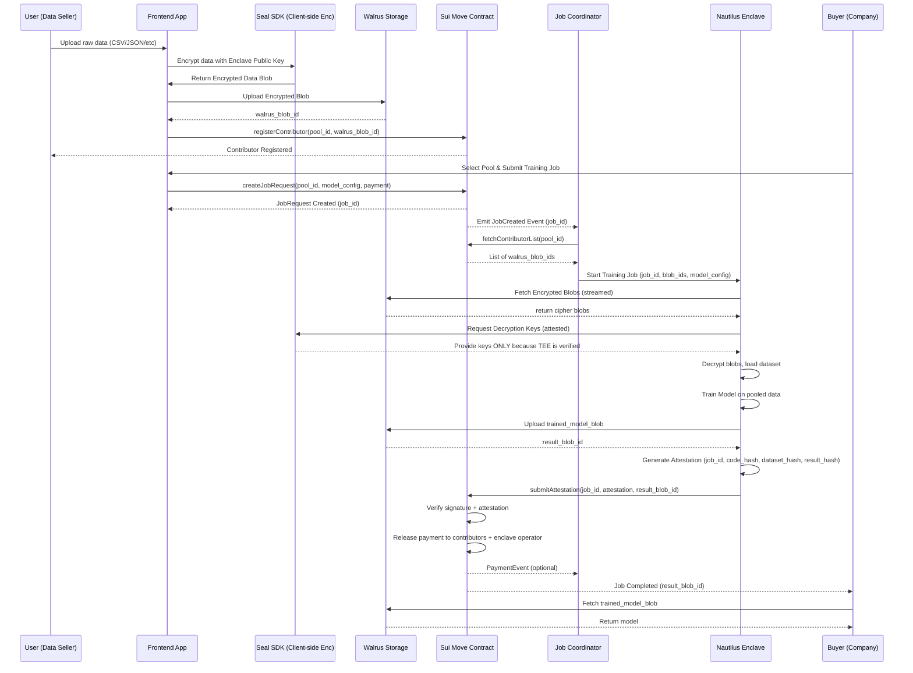

# CloakX

## Privacy-Preserving Data Compute Marketplace

CloakX is a next-generation **privacy-preserving data compute marketplace** where users contribute encrypted data and AI contributors train models on large-scale datasets — without ever exposing raw user information.

Instead of selling data, CloakX enables **secure, permissioned computation** on private datasets using the **Nautilus Trusted Execution Environment (TEE)**. This ensures that data remains encrypted end-to-end while still being useful for high-value AI training and analytics.

## What is CloakX?

CloakX allows:

* Users to upload and monetize their encrypted data securely
* AI contributors to train models on diverse datasets
* All computation to occur inside Nautilus TEE
* Zero access to raw data for any external party

Every computation is verified, traceable, and privacy-safe, making CloakX ideal for sensitive industries like healthcare, fitness, finance, and IoT.

## Core Concept

CloakX redefines data usage by shifting from:

> ❌ Data sharing → ✅ Secure data computation

It provides an infrastructure where:

* Data remains encrypted at all times
* Only computation is permitted
* Insights and models are delivered securely
* Users are rewarded for their contributions

## How It Works

### 1. Data Contribution

* Users encrypt their data locally
* Encrypted data is uploaded to decentralized storage (Walrus)
* Metadata and permissions are recorded on Sui smart contracts

### 2. Dataset Pooling

* Data is organized into thematic pools (health, fitness, mobility, etc.)
* Each pool includes pricing and participation rules

### 3. AI Contributor Request

* Contributors define the type of model or analysis they want
* They stake payment via smart contracts

### 4. Secure Compute (Nautilus TEE)

* Training runs inside the Nautilus Trusted Execution Environment
* Data is decrypted only inside the enclave
* No raw data is accessible to contributors

### 5. Output Delivery

* Final AI model or results are encrypted with the contributor’s public key
* Stored securely and accessible only to them

### 6. Incentivization

* Users earn rewards for participation
* Payments distributed automatically via smart contracts

## Architecture

* **Frontend:** Web interface
* **Blockchain:** Sui for access control and settlement
* **Storage:** Walrus for encrypted decentralized data
* **Compute:** Nautilus TEE for secure AI execution
* **Encryption:** Client-side encryption + public key cryptography

## Key Features

* Privacy-preserving AI training
* Zero raw data exposure
* On-chain permission management
* Programmable consent
* Automated revenue distribution
* Multi-vertical dataset support
* Verifiable compute integrity

## Who Is It For?

### Data Providers

* Individuals with sensitive personal data
* Wearable & IoT users
* Healthcare institutions

### Contributors

* AI startups
* Research institutions
* Enterprises requiring compliant datasets

## Incentive Model

* Contributors pay for compute access
* Users earn proportional rewards
* CloakX charges a protocol fee

## Get Involved

Interested in contributing, integrating, or partnering with CloakX?

Reach out or follow development progress to be part of the privacy-first AI economy.

## License

MIT
