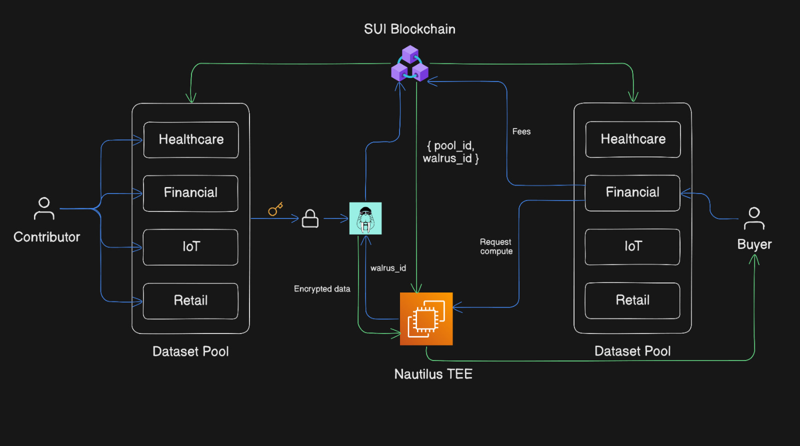
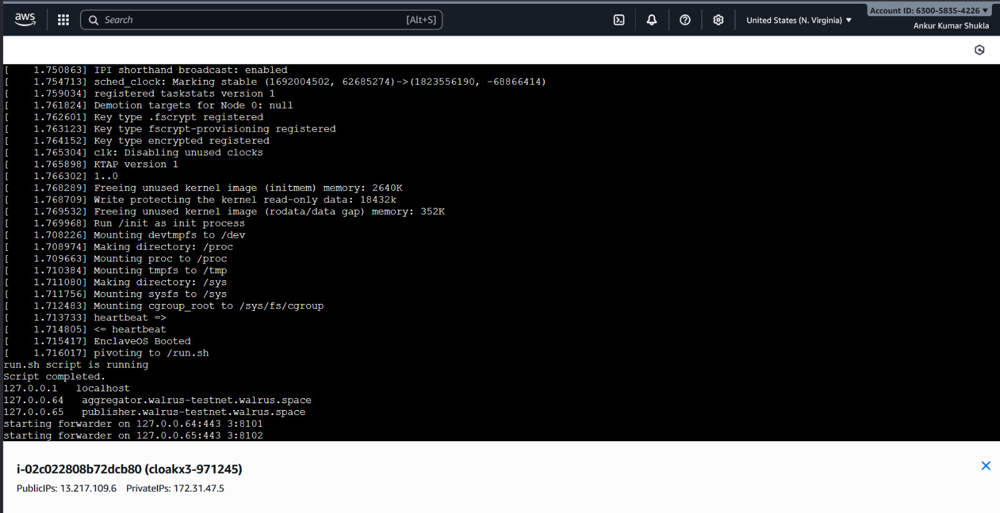
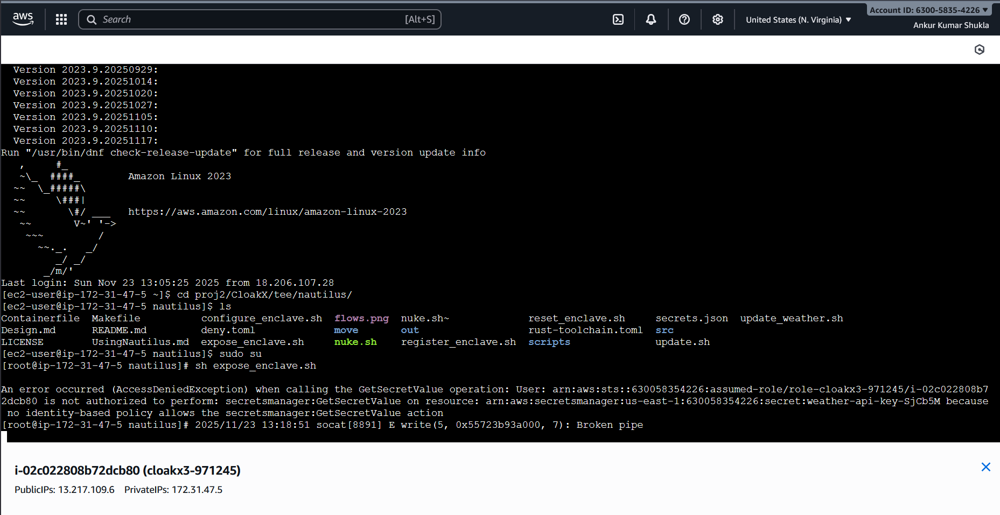

# CloakX Trusted Compute Backend (Nautilus TEE)
<p align="center">
  
  
  
  
</p>

<p align="center">
  
  
  
  
</p>


  Secure, attested, privacy-preserving machine learning compute using the Nautilus framework (AWS Nitro Enclaves).

 
This backend executes encrypted data pipelines inside a hardware-isolated Trusted Execution Environment (TEE), ensuring that raw user data never leaves the enclave.

---

## Overview

The CloakX Trusted Compute Backend powers the privacy-first compute layer of the CloakX ecosystem.  
Its purpose is to allow AI developers and buyers to run model training or data processing jobs on encrypted datasets without ever accessing or viewing raw data.

All compute happens inside the Nautilus TEE, and all outputs include cryptographic attestation proving enclave identity, code integrity, and execution authenticity.

---

## Core Capabilities

- Secure ML compute inside AWS Nitro Enclaves  
- Encrypted data ingestion from Walrus (or blob storage of choice)  
- Full attestation support (PCR validation, EIF measurements)  
- Built-in model training workflow  
- Signed responses using enclave-generated keys  
- Verified & tamper-proof compute outputs  
- Stateless API usable by external apps, research platforms, or blockchains

---

## Project Structure
```text
nautilus/
├── Containerfile
├── Design.md
├── Makefile
├── README.md
├── UsingNautilus.md
├── configure_enclave.sh
├── deny.toml
├── expose_enclave.sh
├── nuke.sh
├── out
│   ├── nitro.eif
│   ├── nitro.pcrs
│   └── rootfs.cpio
├── register_enclave.sh
├── reset_enclave.sh
├── rust-toolchain.toml
├── scripts
│   ├── changed-files.sh
│   └── license_check.sh
├── secrets.json
├── src
│   └── nautilus-server
│       ├── Cargo.lock
│       ├── Cargo.toml
│       ├── run.sh
│       ├── src
│       │   ├── apps
│       │   │   └── mltraining
│       │   │       ├── allowed_endpoints.yaml
│       │   │       ├── assets
│       │   │       │   └── model.pkl
│       │   │       └── mod.rs
│       │   ├── common.rs
│       │   ├── lib.rs
│       │   └── main.rs
│       └── traffic_forwarder.py
├── update.sh

```


## Architecture



**Flow Summary:**

1. Users contribute encrypted data  
2. Metadata & access rules stored on Sui blockchain  
3. Buyer sends compute request  
4. Encrypted data is loaded inside Nautilus TEE  
5. ML training executes securely  
6. Output is encrypted and signed  
7. Attestation + results returned to buyer  

---

## API Endpoints

The backend exposes three public endpoints:

### **1. `/health_check`**  
**Method:** GET  
Returns enclave health, version, and **public key** used to verify signatures.

Try : http://13.217.109.6:3000/health_check

**Response Example:**
```json
{
  "public_key": "<enclave_public_key_hex>"
  "endpoints":[]
}
```
### **2. `/get_attestation`**  
**Method:** GET  
Returns the full Nitro Enclave attestation document, containing:

- PCR values

- EIF measurements

- Enclave public key binding

- Timestamped AMD/SNP attestation

Try : http://13.217.109.6:3000/get_attestation

**Response Example:**
```json
{
  "attestation": "<attestation document>"
}
```
### 3. `/process_data`

**Method:** POST  
Executes a compute or training job inside the enclave.

#### Example cURL Request
```bash
curl -X POST http://13.217.109.6:3000/process_data \
  -H "Content-Type: application/json" \
  -d '{
    "intent": "ProcessData",
    "payload": {
      "data_blob_ids": ["sample_data_blob_id"],
      "model_config_blob_id": "model_config",
      "key_id": "<user_key_to_encrypt model>",
      "learning_rate": 0.001,
      "epochs": 150
    }
  }' --insecure
```
**Response Example:**
```json
{"response":
    {"intent":0,
    "timestamp_ms":1763896931460,
    "data":   
        {"model_blob_id":"0x6ac396e519be8d2b8023dd3c802959e912c9d203be98f801c05b0dc167a5d7cd",
        "accuracy":"76.793006",
        "final_loss":"1.584839",
        "num_samples":"769"}
    },
    "signature":"8d6fad2ab815e3832e9dad40e0768448022283f4917402ba243c89bc7da669d404283e077f59140aa28c3226d5a351d17bcc05bf0b676dad9c5b60335022b109"}
```
## How to setup
Clone repository in your AWS enabled EC2 instance 
```shell
cd CloakX/tee/nautilus/
make run ENCLAVE_APP=mltraining # this builds the enclave
# Open another shell of same instance
sh expose_enclave.sh # this exposes port 3000 to the Internet for traffic
```


## Enclave Running on AWS EC2

Below is a live screenshot from the EC2 instance confirming that the **Nautilus enclave is running successfully**, with the EIF loaded and the enclave process active.




## Limitation & Future Scope
- Right now simple model training is supported like simple neural network and classical ML Algorithim 
- Future we aim to support decentralise training of LLM where data is contributed by people and training and Inference happen securely